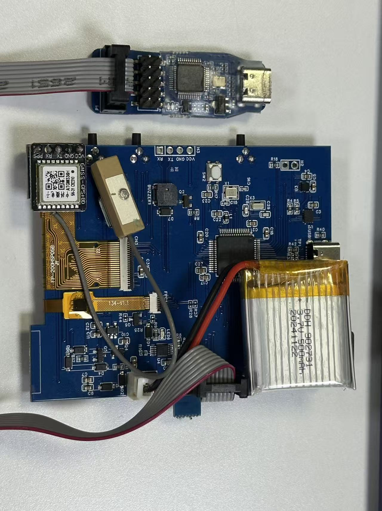

## 1. 项目功能与硬件架构

在项目初期，首先明确了需求与硬件选型。

### 1.1 主要功能
* **基础交互**：基于 LVGL 实现彩色 UI 界面。
* **本地化支持**：支持中英文静态翻译切换，以及浅色/深色模式的动态切换。
* **骑行数据**：实时显示当前的行驶信息（速度、电量、卫星数等）。
* **地图导航**：支持局部的 GPS 地图滚动与路书显示。

### 1.2 硬件选型
* **主控芯片**：STM32F405 / STM32H750。
* **屏幕显示**：240*320 TFT 彩色显示屏（ST7789 驱动），带电容触摸（CST 驱动）。
* **传感器组**：
  * 陀螺仪：LSM6DSMTR（用于计算坡度）。
  * GPS 模块：ATGM336H（中科微国产芯片）。
* **供电系统**：3.7V 三元锂电池。

 

## 2. 第一阶段：Windows 端 LVGL 模拟与 UI 开发

为了脱离硬件束缚、提高 UI 调试效率，前期的界面与交互逻辑全部在 Windows 环境下使用 LVGL 模拟器完成。

### 2.1 UI 页面架构
搭建好配套的工具链后，完成了以下页面的布局：
* **Status Bar（状态栏）**：全局置顶，绑定并显示当前卫星数、运动状态（running/stopped）以及剩余电量。
* **Table View（主视图容器）**，内含三个主要页面：
  * **路书页面**：用于地图与导航显示。
  * **通用页面**：显示常规骑行数据。
  * **设置页面**：系统功能配置。

### 2.2 交互功能实现
* **深/浅色模式切换**：通过给开关控件绑定回调函数，触发时重绘容器的背景颜色。
* **多语言翻译**：没有使用复杂的外部字库解析，而是利用 LVGL 的静态翻译机制，通过给不同语言的内容打上 `tag` 标签，配合下拉菜单的回调函数实现语言切换。

-- 

## 3. 第二阶段：核心技术难点与解决方案

在 PC 模拟阶段，重点攻克了以下两个核心机制问题，这也是本项目的关键技术点。

### 3.1 难点一：地图的动态铺设与性能瓶颈
**需求**：实现地图的无缝滚动效果。
**实现原理**：采用“九宫格”加载机制。初始化时一次性加载 9 张地图切片；当用户屏幕显示的中心点滚动到边缘地图时，动态卸载旧图并重新铺设新的 9 张地图（实际只需更新 5 张边缘图）。图片只有在进入屏幕显示范围时才会去读取链接并渲染。

**遇到的问题：性能与内存溢出**
* **算力瓶颈**：单张地图切片 256*256 像素，色彩深度 2 bytes。如果要在 1 秒内刷写 1 张图片，最小数据量为 128KB。若要达到 30Hz 的流畅帧率，至少需要 3MB/s 的数据吞吐量。而 F405 芯片 168M 主频下的理论 SPI 速度约为 42MB/s，实际传输由于开销会大打折扣，容易出现刷屏卡顿。
* **内存瓶颈**：单片机内部 RAM 有限，但为了保证不花屏，至少需要将一个整屏展示的图片内容全存放到内存中（至少需要 128KB 的 `display_buf`）。
* **解决方案**：在 PC 端利用 SDL 库接口进行渲染加速；在硬件端，考虑升级至 STM32H7 系列，利用 DMA2D 硬件图形加速器来搬运数据，缓解 CPU 压力。

### 3.2 难点二：数据绑定的线程安全问题
**需求**：底层传感器数据更新后，需要实时反馈到 UI 上（如速度、电量）。使用了 `bind_value(subject)` 的数据绑定模式。

**遇到的问题：系统崩溃**
如果在定时器中断（`timer_handler`）中直接修改 UI 绑定的主题数据，会导致 LVGL 渲染线程冲突，引发硬件 HardFault。
* **解决方案**：
  1. 使用 LVGL 自带的 `lv_async_call()` 函数，将数据修改的动作委托给主循环，在下一次调用 `timer_handler` 之前安全处理。
  2. 引入 FreeRTOS 操作系统，使用信号量（Semaphore）或互斥锁（Mutex），严格控制 UI 更新任务与数据读取任务的时序，彻底解决线程安全问题。

---  
## 4. 第三阶段：硬件移植与底层驱动开发

PC 端逻辑跑通后，开始向 STM32 裸机环境移植。

### 4.1 LVGL 框架移植
* 引入 STM32 HAL 库，将 LVGL 源码（`src` 及 `.h` 头文件）加入工程。
* **驱动对接**：编写 `stm32_lcd` 文件对接 ST7789 显示驱动，编写 `indev` 文件对接触摸芯片的 CST 驱动。
* **资源裁剪**：针对单片机 Flash 和 RAM 的限制，对 `lv_conf.h` 进行了严格的宏定义裁剪，关闭了不需要的控件和特性。

### 4.2 底层外设驱动开发
完成了以下具体硬件功能的代码编写：
* **电源电量监控**：通过 ADC 采集电池电压，设定满电阈值为 4.2V，空电阈值为 3.3V，进行百分比换算后映射至状态栏。
* **GPS 定位解析**：通过 USART（串口）接收 ATGM336H 模块上电后持续发送的数据，解析 NMEA 协议字符串，提取经纬度等定位数据。
* **陀螺仪姿态计算**：读取 LSM6DSMTR 数据，利用算法计算出当前的俯仰角（Pitch）和横滚角（Roll），最终合成为最大倾斜角及坡度数据。
* **实体按键**：配置外部中断处理开关机及实体按键交互。

---

## 5. 总结

本项目避开了直接在硬件上低效试错的常规流程，采用了“PC 模拟开发UI逻辑 -> 攻克核心算法与资源瓶颈 -> 移植硬件并补全底层驱动”的标准嵌入式软件开发范式。通过实际解决大图片缓存、SPI 带宽限制以及 LVGL 线程安全等问题，加深了对 MCU 体系结构与 GUI 框架底层运行机制的理解。

# 🚲 基于 STM32 + LVGL 的智能自行车码表

本项目是一款高性能嵌入式自行车码表，实现了从地图渲染、GPS 轨迹模拟到多语言主题切换的完整系统。

---

## 📺 全功能实机演示 (Video Demo)

  <video src="images/demo_video.mp4" width="100%" controls poster="images/hw_map_view.jpg">
    您的浏览器不支持播放该视频，请在仓库中查看。
  </video>
  
<i>实机演示：包含按键交互、地图滑动、语言切换与主题切换</i>

---

## 🚀 核心交互功能 (Interaction Highlights)

| 语言无缝切换 (Language) | 主题动态重绘 (Dark Mode) |
| :---: | :---: |
|  |  |
| 支持中/英动态字典映射 | 支持一键全局重绘 UI 容器 |

---

## 🛠️ 开发历程：从模拟到实装

### 1. LVGL 模拟器验证 (Simulator Stage)
在硬件打样前，基于 PC 端模拟环境完成了 90% 的 UI 逻辑编写。

| 设置界面 | 通用数据页 | 初期原型 |
| :---: | :---: | :---: |
|  |  |  |

### 2. 地图资源处理 (Map Toolchain)
使用定制化工具获取瓦片地图数据，并将其转化为适合嵌入式存储的格式。

---

## 🔌 硬件架构 (Hardware Architecture)

| 硬件背面结构 | 最终实机效果 |
| :---: | :---: |
|  |  |
| **主控**: STM32   **GPS**: ATGM336H   **Power**: 500mAh Li-Po | **屏幕**: 电容触摸屏   **交互**: 实体按键 + 触摸屏 |

---

## 📦 如何使用 (Getting Started)
1. 克隆仓库。
2. 使用 Keil MDK-ARM 打开 `MDK-ARM/speed_meter.uvprojx`。
3. 编译并烧录至开发板。
# 基于 STM32 与 LVGL 的自行车智能码表

这是一个从零开始手敲的嵌入式 GUI 项目。本项目记录了从前期 Windows 端 LVGL 模拟器开发、核心性能问题攻坚，到最终移植至 STM32 硬件平台并完善底层驱动的完整过程。文档旨在清晰复盘项目的实现思路、遇到的技术难点及解决方案。

